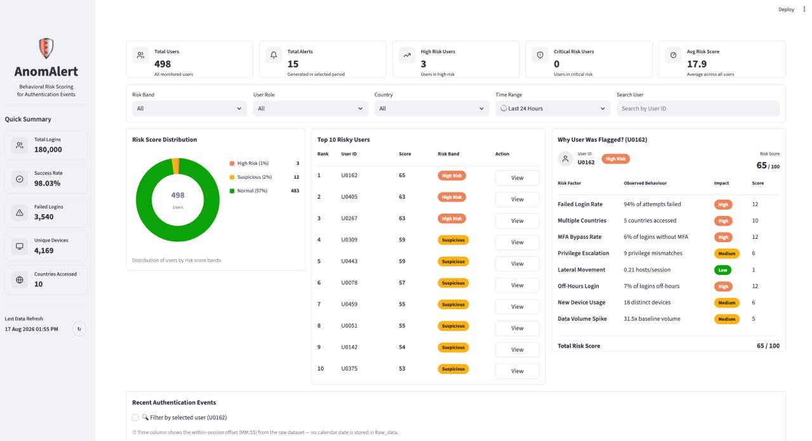
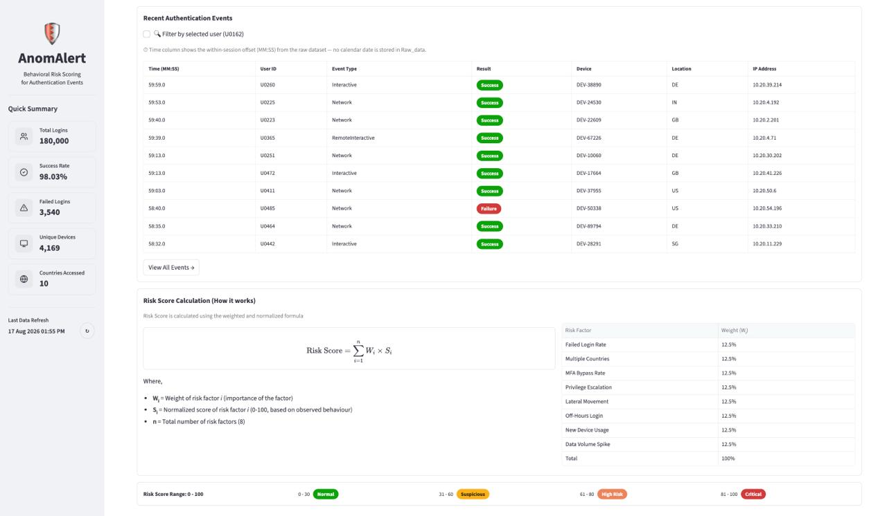

<div align="center">
  
  <h1>AnomAlert</h1>
  <p><b>Behavioral Risk Scoring for Enterprise Authentication Events</b></p>
  <p><i>Detect what others miss. Turn raw telemetry into proactive risk intelligence.</i></p>

  [](https://www.python.org/)
  [](https://streamlit.io/)
  [](https://www.sqlite.org/)
  [](https://pandas.pydata.org/)
  [](https://plotly.com/)
</div>

---

## 📖 Table of Contents
- [Overview](#-overview)
- [The Problem](#-the-problem)
- [Key Features](#-key-features)
- [Dashboard Screenshots](#-dashboard-screenshots)
- [Behavioral Risk Scoring Engine](#-behavioral-risk-scoring-engine)
- [Dataset & Anomaly Injection](#-dataset--anomaly-injection)
- [Installation & Setup](#-installation--setup)
- [Project Structure](#-project-structure)
- [Future Scope](#-future-scope)

---

## 🎯 Overview

**AnomAlert** is a cybersecurity data product that transforms raw authentication telemetry into actionable, per-user risk intelligence. Rather than surfacing thousands of isolated, single-event alerts, AnomAlert evaluates the **continuous behavioral sequence** of every user to proactively identify accounts trending toward compromise.

Designed specifically for **Security Operations Center (SOC) Analysts**, it calculates a transparent, weighted-and-normalized score with explainable reasons, presented through an intuitive Streamlit dashboard.

---

## 🚨 The Problem

Authentication logs are abundant, but insight is scarce.
Traditional reports and SIEM tools treat login events independently. A single failed login or an off-hours access may not indicate a threat. However, a sequence such as:

> **Repeated failed logins → Successful login → New device → Unusual location**

...is a classic pre-compromise behavioral pattern. SOC Analysts suffer from **alert fatigue** trying to manually correlate these events. AnomAlert automates this correlation, eliminating the noise and accelerating threat detection.

---

## ✨ Key Features

- **🛡️ Per-User Behavioral Profiling**: Rolls up thousands of authentication events into a continuous risk view per user.
- **🧮 Explainable Risk Scoring**: A fully transparent, rule-based scoring engine. Every point is traceable to a specific behavioral anomaly metric.
- **🚥 Threshold Alerting**: Automatic banding of users into **Normal**, **Suspicious**, **High Risk**, and **Critical** categories.
- **📊 Interactive SOC Dashboard**: A Streamlit-based UI for monitoring overall authentication statistics, visualizing risk distribution, investigating top risky users, and drilling down into specific user behavior.
- **🔎 Deep Investigation**: View recent authentication events for any selected user, including device, location, IP address, and logon type.

---

## 📸 Dashboard Screenshots


*Overview of authentication statistics, risk distribution, and top risky users.*


*Detailed view of recent authentication events and risk score calculation formula.*

---
## 🧠 Behavioral Risk Scoring Engine

AnomAlert derives a continuous **Risk Score (0–100)** for each user based on **8 normalized behavioral metrics**. The system is completely blind to any synthetic anomaly labels, deriving ground truth entirely from raw metrics.

| # | Behavioral Metric | Detection Target | Weight |
|---|---|---|:---:|
| 1 | **`failed_login_rate`** | Brute-force attempts | 12.5% |
| 2 | **`distinct_geo_count`** | Impossible travel | 12.5% |
| 3 | **`off_hours_ratio`** | Unusual login timing (Off-hours access) | 12.5% |
| 4 | **`privilege_mismatch_count`**| Privilege escalation (Standard vs Admin) | 12.5% |
| 5 | **`distinct_device_count`** | First-ever login from unseen device | 12.5% |
| 6 | **`bytes_spike_ratio`** | Data volume exfiltration spike | 12.5% |
| 7 | **`lateral_movement_rate`** | Rapid host-hopping | 12.5% |
| 8 | **`mfa_bypass_rate`** | Weak authentication posture | 12.5% |

### 🧮 Score Calculation
Each raw metric is min-max scaled (normalized) from 0 to 100 ($s_i$). The composite Risk Score is a weighted average:

$$ \text{Risk Score} = \sum_{i=1}^{8} (0.125 \times s_i) $$
### 🚦 Risk Bands
Scores are evaluated and users are placed into severity bands to prioritize investigation:
- **0–30: Normal** (Baseline Activity)
- **31–60: Suspicious** (Elevated Monitoring)
- **61–80: High Risk** (Active Investigation)
- **81+: Critical** (Immediate Incident Response)

---

## 💾 Dataset & Anomaly Injection

We utilized **180,000 synthetic enterprise authentication events** across 500 users (U0001–U0500).

To rigorously test our scoring engine, we synthetically injected **8 distinct behavioral anomaly patterns** into ~13% of the dataset:
1. `brute_force`
2. `impossible_travel`
3. `off_hours_access`
4. `privilege_escalation`
5. `new_device_login`
6. `dormant_reactivation`
7. `data_volume_spike`
8. `rapid_lateral_movement`

**Note**: The system operates completely blind to these labels. They are used **exclusively for evaluating detection recall**.

---

## 🚀 Installation & Setup

Get the AnomAlert pipeline running in under 5 minutes.

### 1. Clone the repository
```bash
git clone https://github.com/your-org/AnomAlert.git
cd AnomAlert
```

### 2. Set up the Python Environment
Ensure you have Python 3.9+ installed. Create and activate a virtual environment:
```bash
python -m venv .venv
source .venv/bin/activate  # On Windows use: .venv\Scripts\activate
```

### 3. Install Dependencies
```bash
pip install -r requirements.txt
```

### 4. Build Metrics & Risk Scores
Run the data pipeline to aggregate events and calculate risk scores for all users:
```bash
python scripts/build_metrics.py
```
*(This script will process the raw SQLite data, build the `metrics` table, and automatically execute `compute_risk_scores.py`.)*

### 5. Launch the Dashboard
Fire up the interactive Streamlit SOC dashboard:
```bash
streamlit run app.py
```
*The application will be accessible at `http://localhost:8501`.*

---

## 📂 Project Structure

```text
AnomAlert/
│
├── AnomAlert.sqlite             # Primary database with raw events & metrics
├── RawData.sql                  # Original dataset schema and dump
├── inject.sql                   # Synthetic anomaly injection script
├── requirements.txt             # Project dependencies
├── parameter.md                 # Detailed parameter documentation
├── app.py                       # Main Streamlit Dashboard Application
│
├── database/
│   └── db.py                    # SQLite data access layer
│
├── components/                  # Modular UI components for Streamlit
│   ├── filters.py               # Time and User filters
│   ├── kpi_cards.py             # Top-level statistics
│   ├── recent_events.py         # Drill-down authentication log viewer
│   ├── risk_distribution.py     # Pie chart for risk banding
│   ├── risk_formula.py          # Explainability & Math display
│   ├── risk_legend.py           # Band color reference
│   ├── sidebar.py               # Navigation and global context
│   ├── top_users.py             # Table of highest risk users
│   └── user_details.py          # Radar chart and specific anomaly factors
│
└── scripts/                     # Data Pipeline & Scoring Engine
    ├── build_metrics.py         # Aggregates 8 behavioral metrics
    ├── compute_risk_scores.py   # Normalizes metrics and applies risk bands
    └── evaluate_detection.py    # Validates engine recall against injected anomalies
```

---

## 🔮 Future Scope

- **Hybrid ML Layer**: Integration of Isolation Forest and Autoencoders for detecting entirely novel, unseen anomaly behaviors.
- **Real-time Enrichment**: Live ingestion with Threat Intelligence feeds and Geo-IP APIs to augment streaming telemetry.
- **SIEM & SOAR Integration**: Automated incident ticketing and direct integration with remediation platforms.

---

<div align="center">
  <i>Built for Security Operations Centers by the AnomAlert Team.</i>
</div>
